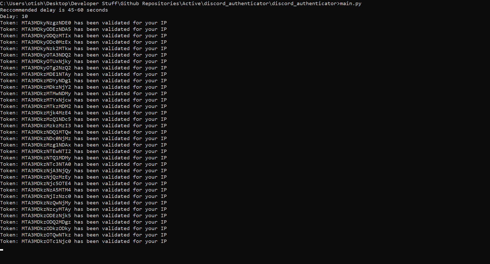

<!DOCTYPE html>

<h1>Discord Authenticator</h1>

<h2>Discord has upped their security on buying tokens/accounts, so unless your seller has an automatic authenticator you'll find yourself locked out of your tokens when trying to login with email/passwords, this will authenticate all your tokens to your IP.</h2>